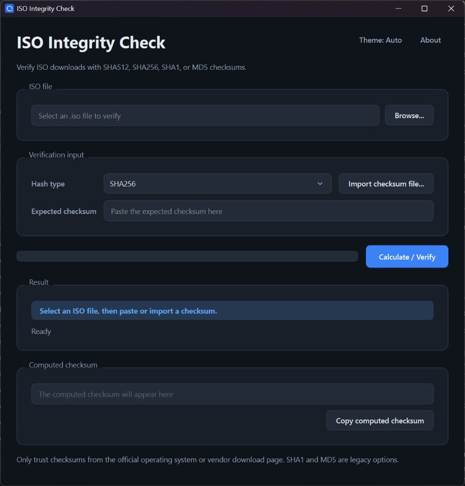

# ISO Integrity Check

[](https://github.com/KaroqDave/ISO-Integrity-check/actions/workflows/build.yml)

A cross-platform desktop app for checking ISO file integrity with trusted checksums.

The app is built with C++ and Qt 6, with a matching headless CLI for scripting.



## Features

- **Cancellable verification** that runs off the UI thread, with live progress, throughput, and an estimated time remaining for large ISO files.
- **Smart checksum input**: pasted checksums are validated as you type, the algorithm is auto-detected from the checksum length, and mismatches highlight all differing characters.
- **Import checksum files** in plain, GNU, and BSD styles (`*.sha256`, `*.sha512`, `*.sha1`, `*.md5`, `*.txt`, `*SUMS`), automatically picking the line that matches the selected ISO.
- **Drag and drop** an ISO or checksum file straight onto the matching section.
- **SHA256, SHA512, SHA1, and MD5**, with native hashing via Windows CNG (BCrypt), OpenSSL when available on Linux/Unix, and Qt's `QCryptographicHash` as a fallback.
- **Light, dark, and system themes**, and it remembers your window, theme, and last-used folders between runs.
- **Headless CLI** (`iso-integrity-check-cli`) that shares the same core for scripting and automation.
- **Cross-platform**: native Windows build and a portable Linux AppImage.

## Download (Ready To Run)

Grab the latest build from the [Releases page](https://github.com/KaroqDave/ISO-Integrity-check/releases):

### Windows

1. Download `ISO-Integrity-Check-<version>.zip`.
2. Extract it anywhere.
3. Run `iso-integrity-check.exe`.

Keep the DLLs and plugin folders next to the executable. If Windows reports missing runtime DLLs, install the latest [Microsoft Visual C++ Redistributable (x64)](https://aka.ms/vs/17/release/vc_redist.x64.exe).

### Linux (AppImage)

1. Download `ISO-Integrity-Check-<version>-x86_64.AppImage`.
2. Make it executable and run it:

```bash
chmod +x ISO-Integrity-Check-*-x86_64.AppImage
./ISO-Integrity-Check-*-x86_64.AppImage
```

The AppImage works on Ubuntu 22.04+, Fedora, Arch, and other recent x86_64 distros. On systems without FUSE2 (some Ubuntu 24.04+ setups), install `libfuse2` or extract and run manually:

```bash
./ISO-Integrity-Check-*-x86_64.AppImage --appimage-extract
./squashfs-root/AppRun
```

## Build From Source

Prerequisites:

- CMake 3.21 or newer.
- Qt 6.8 or newer with the `Core` and `Widgets` components (plus `Test` to run the C++ tests).
- OpenSSL/libcrypto development headers are recommended on Linux/Unix for faster native hashing. If OpenSSL is missing, the build falls back to Qt hashing.
- A C++17 compiler: MSVC (Visual Studio 2022+) on Windows, or GCC/Clang on Linux.

Make sure CMake can find Qt. The simplest way is to point `CMAKE_PREFIX_PATH` at your Qt kit, either as an environment variable (recommended) or on the command line:

```powershell
# Windows (PowerShell)
$env:CMAKE_PREFIX_PATH = "C:\Qt\6.10.3\msvc2022_64"
```

```bash
# Linux
export CMAKE_PREFIX_PATH=/path/to/Qt/6.x/gcc_64
```

### Build with presets (recommended)

The project ships a `CMakePresets.json`, so configuring and building is two commands:

```bash
cmake --preset windows   # use "linux" on Linux
cmake --build --preset windows
ctest --preset windows
```

The Windows build runs `windeployqt` afterwards, so Qt runtime DLLs and plugins are copied beside the executable. Output:

- Windows: `build\Release\iso-integrity-check.exe`
- Linux: `build/iso-integrity-check`

### Build without presets

```bash
cmake -S . -B build -DCMAKE_PREFIX_PATH="C:\Qt\6.10.3\msvc2022_64"
cmake --build build --config Release
ctest --test-dir build -C Release --output-on-failure
```

On Linux, add `-DCMAKE_BUILD_TYPE=Release`. If your Qt installation does not include the `Test` component, configure with `-DISO_BUILD_TESTS=OFF` to build just the apps.

Linux development packages by distro:

| Distro | Packages |
|--------|----------|
| Ubuntu/Debian | `qt6-base-dev`, `cmake`, `g++`, `libssl-dev`, `libgl1-mesa-dev`, `libxkbcommon-dev` |
| Fedora | `qt6-qtbase-devel`, `cmake`, `gcc-c++`, `openssl-devel`, `mesa-libGL-devel`, `libxkbcommon-devel` |
| Arch | `qt6-base`, `cmake`, `gcc`, `openssl`, `mesa`, `libxkbcommon` |

### Editor / IntelliSense setup (clangd)

clangd resolves Qt and MSVC headers from a `compile_commands.json` file. On Linux, configuring (above) creates it in `build/` automatically. On Windows, the Visual Studio generator does not emit one, so run this once after cloning (and again when you add or move source files):

```powershell
./scripts/generate-compile-commands.ps1
```

It writes `compile_commands.json` to the repo root; reload the editor window afterwards.

### Headless CLI

The C++ CLI reuses the same core hashing and parsing logic:

```powershell
build\Release\iso-integrity-check-cli.exe --file "C:\Downloads\example.iso" --expected <sha256>
build\Release\iso-integrity-check-cli.exe --file "C:\Downloads\example.iso" --checksum-file SHA256SUMS
```

```bash
./build/iso-integrity-check-cli --file ./example.iso --algorithm SHA256
```

Exit codes: `0` = match or hash-only success, `1` = mismatch, `2` = error.

## Standalone Build (Export For Distribution)

### Windows

To produce a clean, self-contained folder (and a zip ready for a release), run:

```powershell
./scripts/build-standalone.ps1
```

This builds the Release executable, exports it together with the full Qt runtime to `standalone/ISO-Integrity-Check`, and creates `standalone/ISO-Integrity-Check-<version>.zip`. The `standalone/` folder is regenerated on each run and is not tracked in git.

### Linux

To produce a portable AppImage, run:

```bash
./scripts/build-appimage.sh
```

Set `CMAKE_PREFIX_PATH` if Qt is not found automatically:

```bash
CMAKE_PREFIX_PATH=/path/to/Qt/6.x/gcc_64 ./scripts/build-appimage.sh
```

This creates `standalone/ISO-Integrity-Check-<version>-x86_64.AppImage`.
The script uses `build-linux/` by default so it does not reuse or overwrite a Windows CMake cache in `build/`.

AppImage packaging also needs `curl`, `libfuse2`, and either `librsvg2-bin` (`rsvg-convert`) or ImageMagick (`convert`). On a fresh clone, Git should preserve the executable bit for `scripts/build-appimage.sh`; if your filesystem strips it, run `chmod +x ./scripts/build-appimage.sh` once. The script disables linuxdeploy's strip step by default because older bundled `strip` binaries can fail on modern rolling-release distro libraries.

## Performance

On Windows, hashing uses the CNG (BCrypt) API, which is hardware-accelerated (SHA-NI) when the CPU supports it. On Linux and other Unix-like systems, hashing uses OpenSSL/libcrypto when available and falls back to Qt's `QCryptographicHash` otherwise. File reading is overlapped with hashing for large ISO files.

## Supported Hashes

- SHA256
- SHA512
- SHA1
- MD5

SHA1 and MD5 are included for older ISO sources, but they are not considered strong for modern security verification. Prefer SHA256 or SHA512 when the vendor provides them.

## Supported Checksum Files

The app can import common checksum files such as:

- `.sha256`
- `.sha512`
- `.sha1`
- `.md5`
- `.txt`
- `*SUMS`

It supports plain checksum files, GNU-style files, and BSD-style files:

```text
f2ca1bb6c7e907d06dafe4687e579fce  example.iso
f2ca1bb6c7e907d06dafe4687e579fce *example.iso
SHA256 (example.iso) = f2ca1bb6c7e907d06dafe4687e579fce
```

If a checksum file contains multiple entries, the app prefers the line matching the selected ISO filename. If no filename matches, it uses the first supported checksum it finds. Checksum files larger than 1 MB are rejected.

## How To Use

1. Click **Browse...** and select an `.iso` file.
2. Choose the hash type provided by the official download source, or click **Import checksum file...**.
3. Paste the expected checksum if you are not importing it from a checksum file.
4. Click **Calculate / Verify**.

The app streams files in chunks, so large ISO files are not loaded fully into memory. If no expected checksum is pasted, it will still calculate and show the selected hash.

Only trust checksums published by the official operating system or vendor download page.
