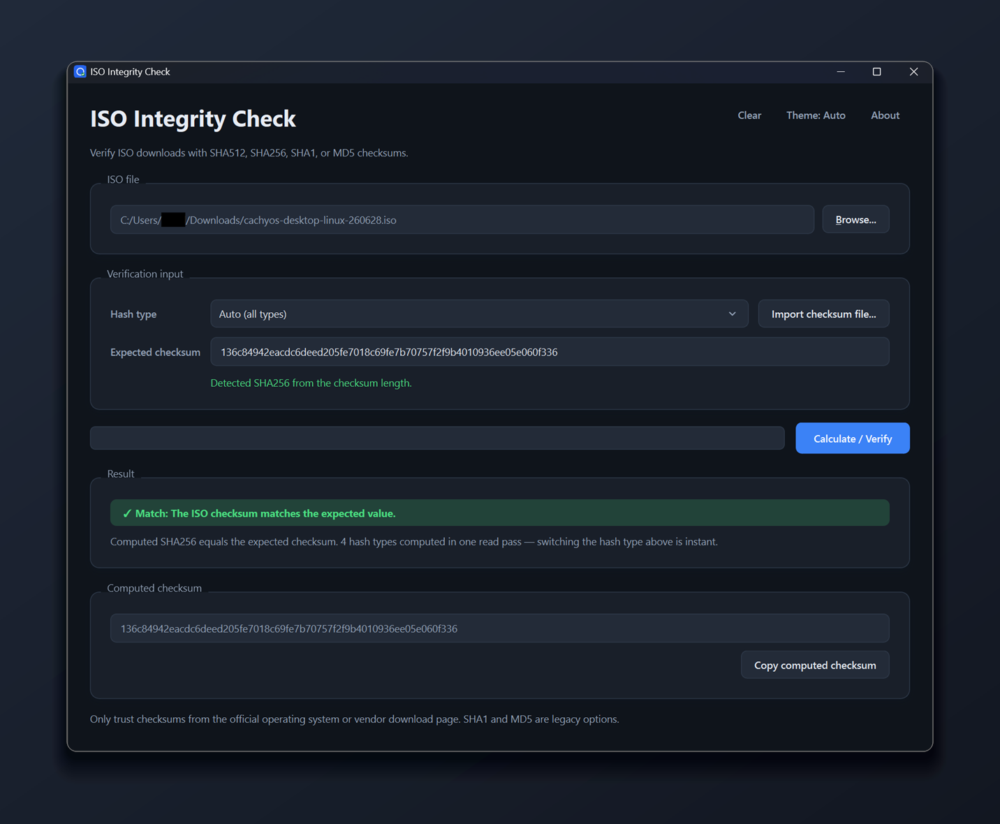

# ISO Integrity Check

[](https://github.com/KaroqDave/ISO-Integrity-check/actions/workflows/build.yml)
[](https://github.com/KaroqDave/ISO-Integrity-check/releases/latest)
[](https://github.com/KaroqDave/ISO-Integrity-check/releases/latest)
[](LICENSE)

A cross-platform desktop app for checking ISO file integrity with trusted checksums.

Pick your ISO, paste the checksum from the vendor's download page, and the app tells you whether the download arrived intact — with a per-character diff when it did not. The hash type defaults to **Auto**, so you do not even need to know which algorithm the vendor used.

Built with C++ and Qt 6, with a matching headless CLI for scripting.



## What's New in 1.3.1

- **Auto is now the default hash type.** Nothing to choose before verifying: paste the vendor's checksum and the app works out which algorithm it belongs to.
- **Auto now computes one digest, not four.** Every hash type has a distinct checksum length, so a pasted checksum identifies its algorithm outright — 1.3.0 hashed all four anyway. Verifying under Auto is now as fast as picking the type by hand, which for a large ISO is roughly four times quicker than 1.3.0.
- **With no checksum pasted, Auto computes SHA256 and SHA512** in a single read, so a checksum pasted after the run usually verifies straight from the cache.
- **Behaviour change from 1.3.0:** switching the hash type after a run is no longer always instant. Auto now computes only what it needs, so a type it skipped requires a fresh run. Types computed earlier stay cached for as long as the file is unchanged.

See the [full release notes](https://github.com/KaroqDave/ISO-Integrity-check/releases/latest) for everything else.

### Previously, in 1.3.0

- **Single-pass multi-algorithm hashing** throughout the core, so several digests cost one read instead of one read each. In the CLI: `--all`, or a comma-separated `--algorithm SHA256,SHA512`.
- **Truncated reads are now detected.** A drive that returns zero bytes without reporting an error — removable media pulled mid-read, a dropped network share — no longer yields the digest of a partial file presented as a valid result.
- **Sturdier error handling.** I/O failures are reported instead of thrown; the CLI previously terminated on an uncaught exception for cases such as a permission-denied file.
- **Interface fixes.** Changing the hash type, or selecting a different ISO, no longer leaves the previous digest on screen under the new label. Light-theme secondary text now meets WCAG AA contrast.

## Features

- **Auto hash type**, selected by default, that identifies the algorithm from the length of the checksum you pasted and computes just that one — as fast as picking the type by hand, without needing to know which the vendor used. With no checksum pasted it computes SHA256 and SHA512 in one read, so one pasted afterwards usually verifies without a second pass.
- **Cancellable verification** that runs off the UI thread, with live progress, throughput, and an estimated time remaining for large ISO files.
- **Smart checksum input**: pasted checksums are validated as you type, the algorithm is auto-detected from the checksum length, and mismatches highlight all differing characters in a side-by-side comparison panel below the result.
- **Import checksum files** in plain, GNU, and BSD styles (`*.sha256`, `*.sha512`, `*.sha1`, `*.md5`, `*.txt`, `*SUMS`), automatically picking the line that matches the selected ISO.
- **Drag and drop** an ISO or checksum file straight onto the matching section.
- **SHA256, SHA512, SHA1, and MD5**, with native hashing via Windows CNG (BCrypt), OpenSSL when available on Linux/Unix, and Qt's `QCryptographicHash` as a fallback.
- **Light, dark, and system themes**, and it remembers your window, theme, and last-used folders between runs.
- **Headless CLI** (`iso-integrity-check-cli`) that shares the same core for scripting and automation.
- **Cross-platform**: native Windows build and a portable Linux AppImage.

## Download (Ready To Run)

Grab the latest build from the [Releases page](https://github.com/KaroqDave/ISO-Integrity-check/releases/latest):

### Windows

1. Download `ISO-Integrity-Check-<version>.zip`.
2. Extract it anywhere.
3. Run `iso-integrity-check.exe`.

Keep the DLLs and plugin folders next to the executable. If Windows reports missing runtime DLLs, install the latest [Microsoft Visual C++ Redistributable (x64)](https://aka.ms/vs/17/release/vc_redist.x64.exe).

### Linux (AppImage)

1. Download `ISO-Integrity-Check-<version>-x86_64.AppImage`.
2. Make it executable and run it:

```bash
chmod +x ISO-Integrity-Check-*-x86_64.AppImage
./ISO-Integrity-Check-*-x86_64.AppImage
```

The AppImage works on Ubuntu 22.04+, Fedora, Arch, and other recent x86_64 distros. On systems without FUSE2 (some Ubuntu 24.04+ setups), install `libfuse2` or extract and run manually:

```bash
./ISO-Integrity-Check-*-x86_64.AppImage --appimage-extract
./squashfs-root/AppRun
```

## Build From Source

Prerequisites:

- CMake 3.21 or newer.
- Qt 6.8 or newer with the `Core` and `Widgets` components (plus `Test` to run the C++ tests).
- OpenSSL/libcrypto development headers are recommended on Linux/Unix for faster native hashing. If OpenSSL is missing, the build falls back to Qt hashing.
- A C++17 compiler: MSVC (Visual Studio 2022+) on Windows, or GCC/Clang on Linux.

Make sure CMake can find Qt. The simplest way is to point `CMAKE_PREFIX_PATH` at your Qt kit, either as an environment variable (recommended) or on the command line:

```powershell
# Windows (PowerShell)
$env:CMAKE_PREFIX_PATH = "C:\Qt\6.10.3\msvc2022_64"
```

```bash
# Linux
export CMAKE_PREFIX_PATH=/path/to/Qt/6.x/gcc_64
```

### Build with presets (recommended)

The project ships a `CMakePresets.json`, so configuring and building is two commands:

```bash
cmake --preset windows   # use "linux" on Linux
cmake --build --preset windows
ctest --preset windows
```

The Windows build runs `windeployqt` afterwards, so Qt runtime DLLs and plugins are copied beside the executable. Output:

- Windows: `build\Release\iso-integrity-check.exe`
- Linux: `build/iso-integrity-check`

### Build without presets

```bash
cmake -S . -B build -DCMAKE_PREFIX_PATH="C:\Qt\6.10.3\msvc2022_64"
cmake --build build --config Release
ctest --test-dir build -C Release --output-on-failure
```

On Linux, add `-DCMAKE_BUILD_TYPE=Release`. If your Qt installation does not include the `Test` component, configure with `-DISO_BUILD_TESTS=OFF` to build just the apps.

Linux development packages by distro:

| Distro | Packages |
|--------|----------|
| Ubuntu/Debian | `qt6-base-dev`, `cmake`, `g++`, `libssl-dev`, `libgl1-mesa-dev`, `libxkbcommon-dev` |
| Fedora | `qt6-qtbase-devel`, `cmake`, `gcc-c++`, `openssl-devel`, `mesa-libGL-devel`, `libxkbcommon-devel` |
| Arch | `qt6-base`, `cmake`, `gcc`, `openssl`, `mesa`, `libxkbcommon` |

### Editor / IntelliSense setup (clangd)

clangd resolves Qt and MSVC headers from a `compile_commands.json` file. On Linux, configuring (above) creates it in `build/` automatically. On Windows, the Visual Studio generator does not emit one, so run this once after cloning (and again when you add or move source files):

```powershell
./scripts/generate-compile-commands.ps1
```

It writes `compile_commands.json` to the repo root; reload the editor window afterwards.

### Headless CLI

The C++ CLI reuses the same core hashing and parsing logic:

```powershell
build\Release\iso-integrity-check-cli.exe --file "C:\Downloads\example.iso" --expected <sha256>
build\Release\iso-integrity-check-cli.exe --file "C:\Downloads\example.iso" --checksum-file SHA256SUMS
```

```bash
./build/iso-integrity-check-cli --file ./example.iso --algorithm SHA256
```

`--algorithm` also accepts a comma-separated list, and `--all` covers every supported algorithm. Either way the file is read once and all requested digests are computed from that single pass:

```bash
./build/iso-integrity-check-cli --file ./example.iso --algorithm SHA256,SHA512
./build/iso-integrity-check-cli --file ./example.iso --all
```

With one algorithm the output keeps the `Algorithm:` / `Computed:` form. With several, each is listed as `<NAME>: <hash>`. When an expected checksum is supplied alongside several algorithms, the one whose length matches the expected value is the one verified, and the CLI prints `Verified against: <NAME>`.

`--unbuffered` reads past the operating system's file cache rather than through it, so checking a large ISO does not evict the rest of the system's cached data. See [Performance](#performance) for when that is worth it.

Exit codes: `0` = match or hash-only success, `1` = mismatch, `2` = error.

On mismatch, the CLI prints `MISMATCH:` and the computed hash. Per-character diff highlighting and position summaries are GUI-only.

## Standalone Build (Export For Distribution)

### Windows

To produce a clean, self-contained folder (and a zip ready for a release), run:

```powershell
./scripts/build-standalone.ps1
```

This builds the Release executable, exports it together with the full Qt runtime to `standalone/ISO-Integrity-Check`, and creates `standalone/ISO-Integrity-Check-<version>.zip`. The `standalone/` folder is regenerated on each run and is not tracked in git.

### Linux

To produce a portable AppImage, run:

```bash
./scripts/build-appimage.sh
```

Set `CMAKE_PREFIX_PATH` if Qt is not found automatically:

```bash
CMAKE_PREFIX_PATH=/path/to/Qt/6.x/gcc_64 ./scripts/build-appimage.sh
```

This creates `standalone/ISO-Integrity-Check-<version>-x86_64.AppImage`.
The script uses `build-linux/` by default so it does not reuse or overwrite a Windows CMake cache in `build/`.

AppImage packaging also needs `curl`, `libfuse2`, and either `librsvg2-bin` (`rsvg-convert`) or ImageMagick (`convert`). On a fresh clone, Git should preserve the executable bit for `scripts/build-appimage.sh`; if your filesystem strips it, run `chmod +x ./scripts/build-appimage.sh` once. The script disables linuxdeploy's strip step by default because older bundled `strip` binaries can fail on modern rolling-release distro libraries.

## Performance

On Windows, hashing uses the CNG (BCrypt) API, which is hardware-accelerated (SHA-NI) when the CPU supports it. On Linux and other Unix-like systems, hashing uses OpenSSL/libcrypto when available and falls back to Qt's `QCryptographicHash` otherwise. File reading is overlapped with hashing for large ISO files.

When several algorithms are requested (the GUI's **Auto** hash type, or `--all` / a comma-separated `--algorithm` in the CLI), the file is read once and every digest is fed from the same chunks, so the cost is one pass over the ISO rather than one per algorithm. The digests also run concurrently, one core each, so the total is set by the *slowest* algorithm rather than the sum of all of them. On a 4 GiB file, SHA256+SHA512 costs about what SHA512 costs alone, and all four algorithms together cost roughly 3.4x a lone SHA256 rather than 9.4x.

A single digest cannot be spread across cores — SHA-2 chains each block onto the previous one — so asking for more algorithms is still never free. It is just far cheaper than it used to be.

### Buffered and unbuffered reads

By default the file is read through the operating system's cache, which is the faster choice for the case this app sees most: checking an ISO that was just downloaded and is therefore still largely in memory.

**Options → Bypass the system file cache** in the GUI, or `--unbuffered` on the CLI, reads past that cache instead. The GUI setting is remembered between runs and applies to the next verification you start. It is not a speed option — on a warm file it is slightly slower, because the digest no longer finds its input already in the CPU's caches. What it buys is restraint: verifying a 5 GB ISO no longer evicts several gigabytes of whatever else the system had cached to make room for bytes that will never be read twice. On a genuinely cold file it is also the quicker path, since nothing is copied by way of the cache. On Windows this uses unbuffered overlapped reads with several requests in flight; on Linux the pages are released after each chunk instead, which reaches the same goal without `O_DIRECT`'s filesystem restrictions. Where unbuffered reads are not possible — NTFS-compressed or encrypted files, some network shares — the app quietly falls back to buffered ones.

### Measuring it yourself

`iso-hash-bench` reports whether hashing on your machine is limited by the disk or by the digest, which is the only thing that decides where further tuning would help:

```bash
./build/Release/iso-hash-bench --size 4096
```

It generates a temporary sample (or use `--file` on a real ISO), then times a read-only pass in both I/O modes, each algorithm on both the native and Qt backends, and all of them in one combined pass. Note that a sample smaller than your free memory will be served from the page cache, so the read figure measures RAM rather than the drive. Pass `-DISO_BUILD_BENCH=OFF` to CMake to skip building the tool.

## Supported Hashes

- SHA256
- SHA512
- SHA1
- MD5

SHA1 and MD5 are included for older ISO sources, but they are not considered strong for modern security verification. Prefer SHA256 or SHA512 when the vendor provides them.

## Supported Checksum Files

The app can import common checksum files such as:

- `.sha256`
- `.sha512`
- `.sha1`
- `.md5`
- `.txt`
- `*SUMS`

It supports plain checksum files, GNU-style files, and BSD-style files:

```text
f2ca1bb6c7e907d06dafe4687e579fce  example.iso
f2ca1bb6c7e907d06dafe4687e579fce *example.iso
SHA256 (example.iso) = f2ca1bb6c7e907d06dafe4687e579fce
```

If a checksum file contains multiple entries, the app prefers the line matching the selected ISO filename. If no filename matches, it uses the first supported checksum it finds. Checksum files larger than 1 MB are rejected.

## How To Use

1. Click **Browse...** and select an `.iso` file, or drag and drop an ISO onto the ISO file section.
2. Paste the expected checksum from the vendor's download page, or click **Import checksum file...** (dragging a checksum file onto the verification input section works too).
3. Click **Calculate / Verify**.

The hash type starts on **Auto**, so step 2 does not require knowing whether the vendor published SHA256 or SHA512 — Auto detects it from the checksum you pasted, at no cost over picking the type yourself.

While verification runs, the button changes to **Cancel** so you can stop a long hash on a large ISO. Leave the expected checksum empty to calculate the hash only — the app shows the computed value without comparing it.

### Choosing a hash type

**Auto** identifies the hash type from the length of the expected checksum — every type has a distinct one — and computes only that type. Verifying under Auto therefore costs exactly what selecting the type by hand costs: one digest, one read. You save the step of knowing whether the vendor published SHA256 or SHA512, not any speed.

With no checksum pasted there is nothing to identify, so Auto computes SHA256 and SHA512 in a single read. That second digest is a hedge: a checksum pasted after the run usually verifies straight from the cache rather than re-reading a multi-gigabyte file.

Switching to a hash type the run did not compute needs a fresh run. Digests accumulate across runs for as long as the file is unchanged, so a type computed earlier stays instant to switch back to.

With a specific type selected, changing it clears the computed field rather than relabelling the old digest, since a hash from one algorithm must never be displayed under another's name.

### When the checksums differ

On a mismatch, the expected and computed fields are outlined in orange and a comparison panel appears below the result, highlighting every differing character and listing the 1-based positions of the differences.

The app streams files in chunks, so large ISO files are not loaded fully into memory.

Only trust checksums published by the official operating system or vendor download page.
